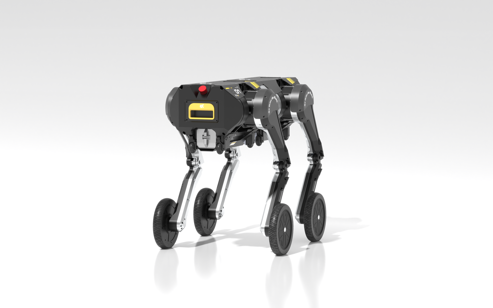

> # Welcome to D1-Robot Documentation!

```{toctree}
:maxdepth: 1

pages/Quick_Start
pages/SDK_Development
pages/sim2sim_sim2real
pages/D1_remote_ctrl
pages/how-to-pair
pages/OTA_model

```
Last updated: 2025-11-21

--------

## Product Introduction

D-INFINITE (referred to as D1) is the world’s first wheel-legged robot featuring fully modular whole-machine architecture. It perfectly combines the agility of wheeled robots with the adaptability of legged robots, and additionally supports physical fusion and separation between two robots. With a modular design and open interfaces, it can carry vision modules, communication modules, AI computers, edge processors, and a variety of sensors. It also supports replacing wheel hubs to transform into point-foot or flat-foot configurations, offering high playability and significant research value.



-------

#### D-infinite (D1) Specification V2.3
##### 1. Specification Table
| Category    | Parameter Name                   | Parameter Value                                              |
| ----------- | -------------------------------- | ------------------------------------------------------------ |
| Mechanical  | Standing Dimensions              | 375/750 × 493 × 643 mm                                       |
| Mechanical  | Crawling Dimensions              | 470/845 × 580 × 250 mm                                       |
| Mechanical  | Material                         | Aluminum alloy + high-strength engineering plastic           |
| Mechanical  | Weight (with connector)          | 24.3 kg / 48.5 kg                                            |
| Mechanical  | Degrees of Freedom               | 8 / 16 DOF                                                   |
| Mechanical  | Max Joint Torque                 | 120 Nm                                                       |
| Mechanical  | Joint Motion Range               | Body: -45° ~ 45°; Thigh: -195° ~ 105°; Calf: 22.46° ~ 132.46° |
| Electrical  | Processor                        | Default: Jetson Orin NX 8GB                                  |
| Electrical  | WiFi Type                        | WIFI6                                                        |
| Electrical  | Remote Controller Link           | ELRS                                                         |
| Electrical  | Battery Specifications           | Single unit: 43.2V 9Ah (388.8 Wh)                            |
| Electrical  | Battery Compartment              | Single battery for single-unit, two batteries for dual-unit  |
| Electrical  | External Interfaces              | USB Type-C ×2, Gigabit Ethernet ×1, Battery Port ×1          |
| Electrical  | Fusion Communication Port        | CAN-FD                                                       |
| Electrical  | Remote Power Cutoff              | Supported                                                    |
| Electrical  | Hot-swap Battery                 | Not hot-swappable; battery removable                         |
| Performance | Default Fusion Mode              | Same-bend (<<)                                               |
| Performance | Remote Key Power Cutoff Distance | ~3 m                                                         |
| Performance | Runtime Endurance                | Four-leg mode: ~2 h / Dual-wheel-leg mode: ~5 h              |
| Performance | Range                            | Four-leg: ~15 km / Dual-wheel-leg: ~25 km                    |
| Performance | Max Standing Load                | Four-leg: 80 kg / Dual-wheel-leg: 30 kg                      |
| Performance | Standard Charging Time           | <2 h                                                         |
| Performance | Operating Temperature            | 0 ~ 45°C                                                     |
| Performance | Max Walking Load                 | Four-leg: >50 kg / Dual-wheel-leg: >20 kg                    |
| Performance | Continuous Walking Load          | Four-leg: >10 kg / Dual-wheel-leg: >5 kg                     |
| Performance | Stair-climbing Ability           | Dual-wheel-leg: 15 cm / Four-leg: 15 cm                      |
| Performance | Crawling Load Capacity           | >100 kg                                                      |
| Performance | Max Continuous Speed             | ~3 m/s                                                       |
| Performance | Slope Capability                 | Four-leg: >35° / Dual-wheel-leg: >25°                        |
| Performance | Climbing Height                  | Max 70 cm, recommended 50 cm                                 |
| Performance | Turning Radius (Single)          | 270 mm                                                       |
| Performance | Crawling Mode                    | Supported                                                    |
| Performance | Flash-fusion                     | Supported (<5 s)                                             |
| Others      | OTA Upgrade                      | Supported                                                    |
| Others      | Robotic Arm Accessories          | Continuously updated                                         |
| Others      | Power Board Accessories          | Continuously updated                                         |
| Others      | LiDAR Accessories                | -                                                            |
| Others      | Large Wheel-hub Option           | -                                                            |
| Others      | Operating System                 | Ubuntu 22.04                                                 |
| Others      | Standard API                     | ROS 2                                                        |

### Acknowledgment
Thank you very much for choosing our product. We are committed to providing the highest-quality products and services. Your satisfaction is our greatest pursuit. If you have any questions or need assistance during use, please feel free to contact us. We will serve you wholeheartedly.
 Thank you again for your trust and support!

<!-- For quick start please refer to Quick Start page -->

