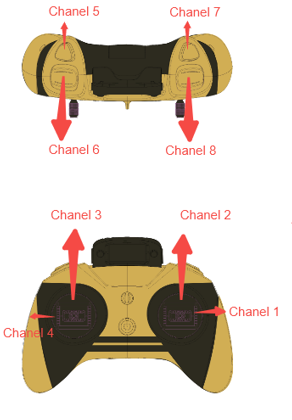

# 求之 Airbot 机械臂在 D1 上的控制指南

## 环境部署

```bash
git clone https://github.com/DDTRobot/airbot-environment-deployment.git
cd airbot-environment-deployment
bash install.sh
```

## 运行

### 启动机械臂服务

首次启动时需要联网登录：

```bash
sudo airbot_server -i can1 -p 50000
```

### 使用键盘控制

```bash
python3 -m airbot_examples.task_kbd_ctrl -p 50000
```

### 使用手柄控制

运行前请通过 `ros2 topic list` 确认命名空间，并修改 `--namespace` 参数：

```bash
cd airbot-environment-deployment
python3 airbot_joy_D1.py --namespace d13042528 --port 50000
```



## 手柄通道说明

| 通道 | 控件 |
| --- | --- |
| Channel 1 | 右侧摇杆左右 |
| Channel 2 | 右侧摇杆前后 |
| Channel 3 | 左侧摇杆前后 |
| Channel 4 | 左侧摇杆左右 |
| Channel 5 | 左侧按键 |
| Channel 6 | 左侧三级按键 |
| Channel 7 | 右侧按键 |
| Channel 8 | 右侧三级按键 |

## 按钮功能

### 左侧按键（Channel 5）

- 按下：进入笛卡尔速度模式。
- 弹起：进入关节控制模式。

### 左侧三级按键（Channel 6）

- 笛卡尔速度模式：与 Channel 4 组合控制，绕 X、Y 或 Z 轴旋转。
- 关节控制模式：与 Channel 1 和 Channel 2 组合控制，实现 1～2、3～4 或 5～6 关节运动。

### 右侧按键（Channel 7）

- 短按：控制夹爪开关。
- 长按：机械臂回到规划位置，请注意预留安全距离。

### 右侧三级按键（Channel 8）

用于三挡速度控制。拨到最上方时为最高速度，请注意操作安全。

## 摇杆功能

| 摇杆 | 笛卡尔速度模式 | 关节控制模式 |
| --- | --- | --- |
| 右侧摇杆左右（Channel 1） | 沿 Y 轴直线运动 | 与 Channel 6 配合控制关节运动 |
| 右侧摇杆前后（Channel 2） | 沿 X 轴直线运动 | 与 Channel 6 配合控制关节运动 |
| 左侧摇杆前后（Channel 3） | 沿 Z 轴直线运动 | 无控制 |
| 左侧摇杆左右（Channel 4） | 与 Channel 6 配合，绕 X、Y 或 Z 轴旋转 | 无控制 |

## 开发文档

更多示例请参考 [Airbot Play Python SDK 文档](https://docs.airbots.online/airbot-play-python-sdk/latest/Python%20SDK/examples.html)。
