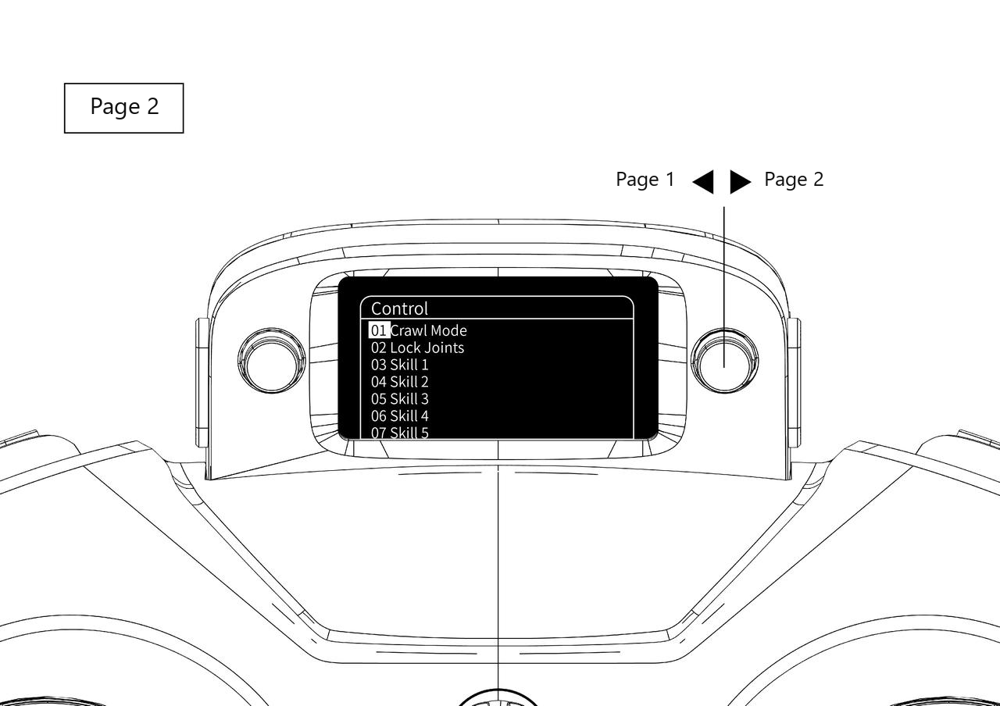

# Remote Controller Instructions
```{toctree}
:maxdepth: 1
:glob:
```
------


For detailed information on how to pair the remote controller, see:[Remote Controller Pairing](how-to-pair.md)


## Common Control Mappings

### Biped-Wheeled Mode (Default)

| Mode            | Start Button | Left Switch | Right Switch | Description            | Left Stick     | Right Stick                              |
| --------------- | ------------ | ----------------- | ------------------ | ---------------------- | -------------- | ---------------------------------------- |
| None            | Pressed      | Middle            | Any                | Height adjustment      | Forward & turn | Push forward to raise, backward to lower |
| None            | Pressed      | Up                | Up                 | Pitch adjustment       | Forward & turn | Forward = head up, backward = head down  |
| 03 (skill 1)    | Pressed      | Middle            | Any                | RL flat-ground mode    | Forward & turn | Side-walking                             |
| 04 (skill 2)    | Pressed      | Middle            | Any                | RL stair-climbing mode | Forward & turn | Disabled                                 |
| 06 (crawl mode) | Released     | Any               | Any                | Vehicle mode           | Forward & turn | Disabled                                 |

### Quadruped Mode (Default)

| Mode         | Jump Button | Left Switch | Right Switch | Description           | Left Stick     | Right Stick  |
| ------------ | ----------- | ---------- | ----------- | --------------------- | -------------- | ------------ |
| None         | Released    | Middle     | Any         | RL flat-ground mode   | Forward & turn | Side-walking |
| 03 (skill 1) | Released    | Middle     | Any         | RL stair mode         | Forward & turn | Side-walking |
| 04 (skill 2) | Released    | Middle     | Any         | RL high-platform mode | Forward & turn | Disabled     |
| 05 (skill 3) | Released    | Up         | Any         | Degrees-of-freedom demonstration | Pose demonstration | Pose demonstration |
| None         | Pressed     | Middle     | Any         | Forward jump mode     | Disabled       | Disabled     |

### State Machine
The controller's internal FSM transitions as shown below.Arrows indicate permissible transitions between states.Quadruped control does not include the car state. An asterisk (*) in the menu indicates the current state (03–07).


### Remote Controller Menu

Press the right-side button to enter the menu. The left image shows page 1, and the right image shows page 2. Push the right-side directional button to the right to open page 2, or to the left to return to page 1.

 

**Page 1 — Mode**

- **01 Quadruped Mode:** Switch to quadruped mode by switching the system service.
- **02 Unlock Bolt:** Unlock the docking mechanism; switch to biped-wheeled mode first.
- **03 SDK Mode:** Enable joystick SDK mode and stop publishing ROS 2 command topics.
- **04 Key Pair:** Pair the remote emergency stop switch.
- **05 Key Unpair:** Unpair the remote emergency stop switch.

**Page 2 — Control**

- **01 Crawl Mode:** Crawl mode, available in biped-wheeled mode only.
- **02 Lock Joints:** Lock the joints.
- **03 Skill 1:** Biped-wheeled side-walking / quadruped stair climbing.
- **04 Skill 2:** Biped-wheeled stair climbing / quadruped high-platform climbing.
- **05 Skill 3:** Not enabled in biped-wheeled mode / pose demonstration in quadruped mode.

### Unlock / Fusion Switching


### Configuration Modification

#### Remote Controller Configuration（ROS2）

Edit the YAML parameters in the teleop_command package:
```yaml
  teleop_command:
    ros__parameters:
      can_interface: vcan0
      net_interface: wlan0 
      uart_interface: /dev/ttyUSB0
      update_rate: 10 # Hz
      use_sdk: false # Whether to enable joystick SDK mode by default; false means disabled
      enable_low_battery_check: false  # Low-battery protection; if enabled, the robot will lay down when battery is low
      battery_percentage_threshold: 0.1 # Threshold; when battery percentage falls below this value, robot enters low-battery state
      enable_joystick_disconnect_check: false # Joystick disconnection detection; if enabled, the robot will lay down when the joystick disconnects
      joystick_disconnect_time_threshold: 1.0 # Detection timeout; joystick is considered disconnected if exceeded
      joystick_deadzone: 0.013
      speed_ratio: [0.33, 0.66, 1.0]
      max_twist_linear: 3.0
      max_twist_angular: 6.0
      max_roll: 0.2
      max_pitch: 0.4
```
### Motion Control Adjustments

- Modify control frequency in:

  Quadruped:

  ```
  vim /opt/y1_ros2/share/rl_controller/config/y1v0/controllers.yaml
  ```

  Biped-wheeled:

  ```
  vim /opt/y1_ros2/share/rl_controller/config/y1v0h_evt1/controllers.yaml
  ```

  Set the integer `update_rate` values under `controller_manager` and `*_rl_controller` to the desired control frequency in Hz. The default is 500 Hz. Restart the robot for the changes to take effect.

  
  

### ERROR CODE 

| Code   | Description                                                  | Version |
| ------ | ------------------------------------------------------------ | ------- |
| 0x1000 | The first digit, 1, indicates a read error; the second and third digits contain the motor error code (00, 01, 03); the fourth digit is the motor index (0–F). For example, in 0x1623, 1 indicates an error, 62 is the error code, and 3 identifies the fourth motor.<br>0x1000: all front-unit motors are offline; self-check failed.<br>0x1008: all rear-unit motors are offline; self-check failed.<br>0x1010: front-unit left-leg motor 0 is offline.<br>0x1033: front-unit left-leg motor 3 (wheel motor) has an overvoltage error.<br>Note: Only wheel-hub motors currently provide detailed error codes; joint motors report only error 01. |         |
| 0x385  | Fusion connector CAN data abnormal, possibly disconnected or cable damaged |         |
