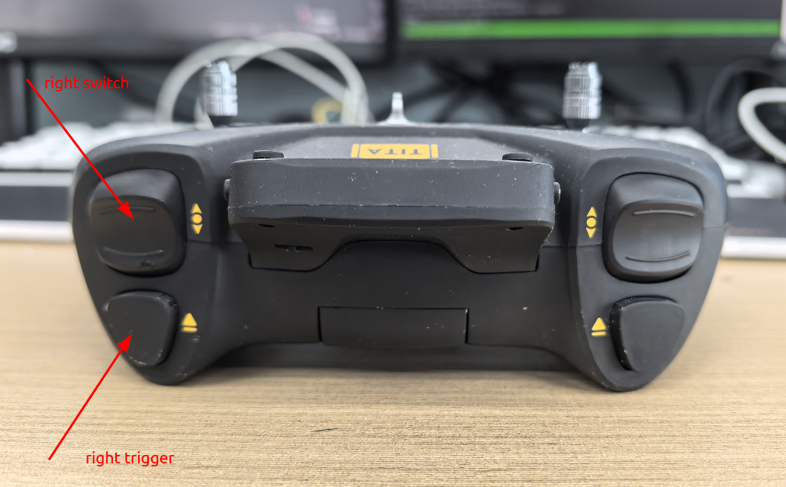
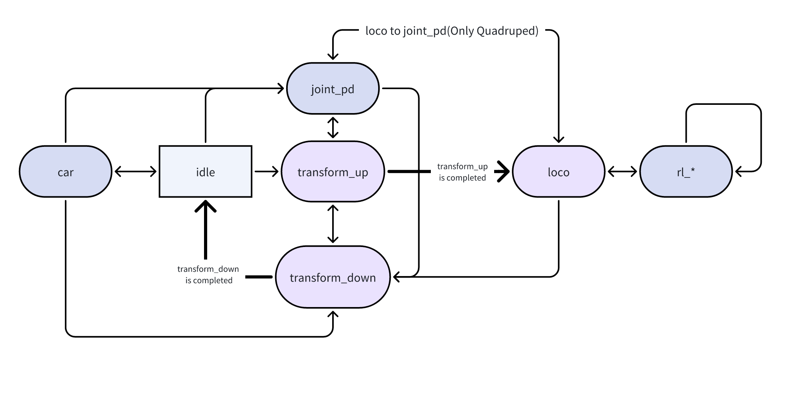
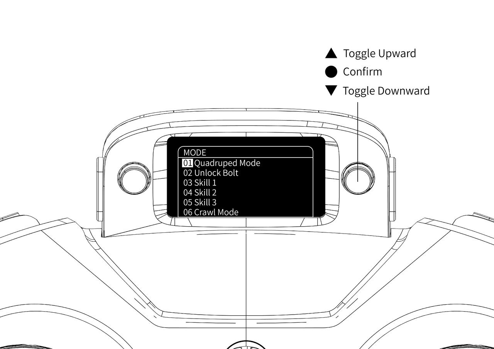
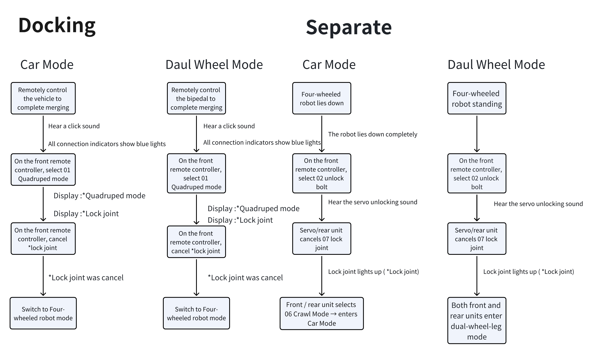
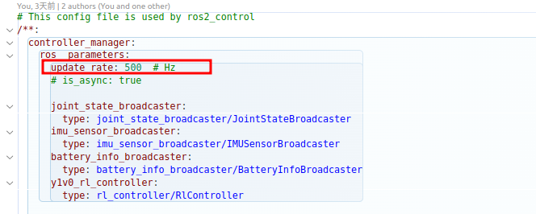
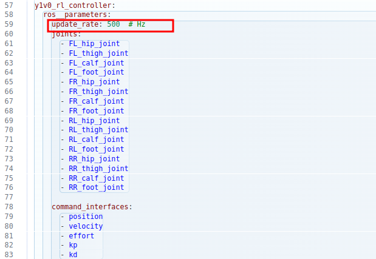

# Remote Controller Instructions
```{toctree}
:maxdepth: 1
:glob:
```
------





For detailed information on how to pair the remote controller, see:[Remote Controller Pairing](how-to-pair.md)


## Common Control Mappings

### Dual-Wheel-Leg Mode (Default)

| Mode            | Start Button | Left 3-Way Switch | Right 3-Way Switch | Description            | Left Stick     | Right Stick                              |
| --------------- | ------------ | ----------------- | ------------------ | ---------------------- | -------------- | ---------------------------------------- |
| None            | Pressed      | Middle            | Any                | Height adjustment      | Forward & turn | Push forward to raise, backward to lower |
| None            | Pressed      | Up                | Up                 | Pitch adjustment       | Forward & turn | Forward = head up, backward = head down  |
| 03 (skill 1)    | Pressed      | Middle            | Any                | RL flat-ground mode    | Forward & turn | Side-walking                             |
| 04 (skill 2)    | Pressed      | Middle            | Any                | RL stair-climbing mode | Forward & turn | Disabled                                 |
| 06 (crawl mode) | Released     | Any               | Any                | Vehicle mode           | Forward & turn | Disabled                                 |

### Quadruped Mode (Default)

| Mode         | Jump Button | Left 3-Way | Right 3-Way | Description           | Left Stick     | Right Stick  |
| ------------ | ----------- | ---------- | ----------- | --------------------- | -------------- | ------------ |
| None         | Released    | Middle     | Any         | RL flat-ground mode   | Forward & turn | Side-walking |
| 03 (skill 1) | Released    | Middle     | Any         | RL stair mode         | Forward & turn | Side-walking |
| 04 (skill 2) | Released    | Middle     | Any         | RL high-platform mode | Forward & turn | Disabled     |
| 05 (skill 3) | Released    | Middle     | Any         | Spinning mode         | Turning        | Disabled     |
| None         | Pressed     | Middle     | Any         | Rotational jump mode  | Disabled       | Disabled     |

### State Machine
The controller's internal FSM transitions as shown below.Arrows indicate permissible transitions between states.Quadruped control does not include the car state. An asterisk (*) in the menu indicates the current state (03–07).



### Remote Controller Menu
1、Entering the Menu

- Press the right-side button to enter the menu:


Menu items:
- 01 Switch quadruped mode (switching system service)
- 02 Unlock fusion/connection mechanism (requires switching to dual-wheel-leg first)
- 03 RL control strategy 1 (dual-wheel side-walk / quadruped stair climbing)
- 04 RL control strategy 2 (dual-wheel stair-climb / quadruped high-platform)
- 05 RL control strategy 3 (not used)
- 06 Crawl mode (dual-wheel only)
- 07 Lock joints
- 08 Joystick SDK mode (disables ROS 2 command publishing)

### Unlock / Fusion Switching



### Configuration Modification

#### Remote Controller Configuration（ROS2）

Edit the YAML parameters in the teleop_command package:
```{Markdown}
  teleop_command:
    ros__parameters:
      can_interface: vcan0
      net_interface: wlan0 
      uart_interface: /dev/ttyUSB0
      update_rate: 10 # Hz
      use_sdk: false # 默认是否启动joystick的sdk模式，默认false不启动
      enable_low_battery_check: false # 低电量，电量低机器会趴下，true为启动
      battery_percentage_threshold: 0.1 # 阈值，当电量低于此值进入到低电量状态，
      enable_joystick_disconnect_check: false # 遥控器断连检测，断连后机器会趴下，true为启动
      joystick_disconnect_time_threshold: 1.0 # 检测时间，超出此时间，遥控器断连
      joystick_deadzone: 0.013
      speed_ratio: [0.33, 0.66, 1.0]
      max_twist_linear: 3.0
      max_twist_angular: 6.0
      max_roll: 0.2
      max_pitch: 0.4
```
### Motion Control Adjustments

- Modify control frequency in:

  Quadruped:

  ```
  vim /opt/y1_ros2/share/rl_controller/config/y1v0/controllers.yaml
  ```

  Dual-wheel-leg:

  ```
  vim /opt/y1_ros2/share/rl_controller/config/y1v0h_evt1/controllers.yaml
  ```

  Adjust the `update_rate` field (Hz). Default is 500 Hz.
  

### ERROR CODE 

| Code   | Description                                                  | Version |
| ------ | ------------------------------------------------------------ | ------- |
| 0x1000 | First digit = read error, 2nd–3rd = motor error (00 01 03), 4th = motor index. <br>Examples: <br>0x1000: all front motors offline <br>0x1008: all rear motors offline <br>0x1010: front left leg motor 0 offline <br>0x1033: wheel motor overvoltage |         |
| 0x2000 | Motor command transmission failure, usually "No buffer available" |         |
| 0x100  | Cannot switch to quadruped mode                              |         |
| 0x200  | Unlocking failed                                             |         |
| 0x385  | Fusion connector CAN data abnormal, possibly disconnected or cable damaged |         |