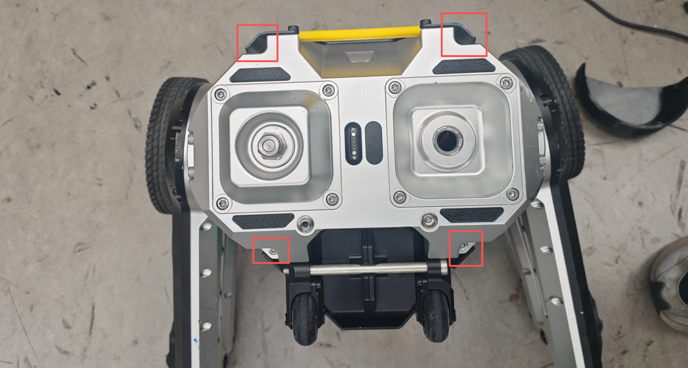

<!--
 * @Author: blank1 448913821@qq.com
 * @Date: 2026-01-07 10:20:05
 * @LastEditors: blank1 448913821@qq.com
 * @LastEditTime: 2026-01-07 10:26:31
 * @FilePath: \D1-Development-Manual\pages\FAQ.md
 * @Description: 这是默认设置,请设置`customMade`, 打开koroFileHeader查看配置 进行设置: https://github.com/OBKoro1/koro1FileHeader/wiki/%E9%85%8D%E7%BD%AE
-->
# 常见问题

```{toctree}
:maxdepth: 1
:glob:
```

------

## 机器人连接处异响

若听见机器人连接处有异响，可能是由于连接机构螺丝松动导致,为了方便对接机构快速拆装/替换,因此连接处螺丝并未使用防松措施,用户可以在使用中定期检查连接处螺丝的紧固情况,如有松动请使用内六角扳手进行紧固.
 


