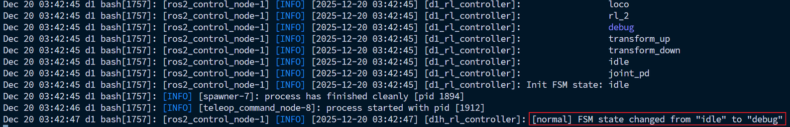

# Quick Start
```{toctree}
:maxdepth: 1
:glob:
```
------


## Environment Dependencies

### System Environment

It is recommended to develop and debug under **Ubuntu 22.04** with **ROS2 Humble**.
You may develop directly on the D1 built-in computer or on an external computer connected to D1.

### Network Environment

Prepare a USB Type-C cable and plug it into the Type-C port closest to the Ethernet port,enter the command below to access the robot system:
```bash
ssh robot@192.168.42.1
#password ： ddt
```
The network interface used for communication between the user’s computer and the D1 robot is in the **192.168.42.xxx** subnet, and the IP is assigned automatically—no configuration is required.

```{warning}
1. Windows users cannot recognize the USB network interface after inserting the USB Type-C cable due to missing drivers. Please install the driver manually:https://milkv.io/zh/docs/duo/getting-started/setup#
2. Do NOT use the flashing cable for debugging, to avoid accidental entry into flashing mode, which may pree systvent them from booting properly.
```
#### Wi-Fi Hotspot Connection
To download ROS packages and other dependencies, the robot must connect to the internet. Steps:
```bash
1. Run: sudo vim /etc/wpa_supplicant/wpa_supplicant-nl80211-wlan0.conf
2. Modify the fields: ssid = "WIFI name"; psk = "Password"
3. Reboot the system after modification.
```
Example:


#### Wi-Fi AP Hotspot Mode
See details in:[WIFI Hotspot Mode](TITA-wifi_app.md)


### Ethernet Port Configuration
This configuration is for users who want to connect an external computer to D1 using an Ethernet cable.
```bash
sudo apt update
sudo apt install network-manager
```
Download the configuration tool:
```bash
sudo apt-get install git  # Install git if necessary
git clone https://github.com/DDTRobot/TowerNetworkManager.git
```
Install:
```bash
cd TowerNetworkManager/
chmod 777 install.sh
sudo ./install.sh
sudo rm -rf /etc/wpa_supplicant/wpa_supplicant-nl80211-wlan0.conf  # Delete the original WiFi config to avoid conflicts. For future WiFi use: sudo nmcli device wifi connect "example" password "1111111"
```
After completing the above, `ifconfig` will show that **eth0** obtains an IP automatically (e.g., 192.168.19.97), and external devices will be assigned IPs in the **192.168.19.xx** range.


### Install Build Tools

Install the build tool `colcon build` on the D1 system:
```bash 
sudo apt update
sudo apt-get install python3-colcon-common-extensions
```
If installation fails, configure the following:

``````
Create or edit a configuration file:
```
sudo vim /etc/apt/apt.conf.d/99insecure
```
Add:
```
Acquire::AllowInsecureRepositories "true";
Acquire::AllowDowngradeToInsecureRepositories "true";
```
Then run `sudo apt update` again.
``````

## ROS2 SDK

`D1_sdk_ros2` is developed based on ROS2. High-level logic is encapsulated into ROS2 nodes, providing ROS2 APIs to the user.
 Users send ROS2 topics to control the robot.

View ROS topics:

```bash 
robot@tita:~$ ros2 topic list 
/d13007137/command/cmd_key # Control command, state machine switching
/d13007137/command/cmd_pose # Control command, pose
/d13007137/command/cmd_twist # Control command, velocity
/d13007137/command/joint_command # Control command, joint velocity
/d13007137/d1_rl_controller/transition_event # D1 reinforcement learning controller transition event
/d13007137/d1h_rl_controller/transition_event # D1H reinforcement learning controller transition event
/d13007137/dynamic_joint_states # Dynamic joint states
/d13007137/imu_sensor_broadcaster/imu # IMU sensor status
/d13007137/imu_sensor_broadcaster/transition_event # IMU sensor broadcaster transition event
/d13007137/joint_state_broadcaster/transition_event # Joint state broadcaster transition event
/d13007137/joint_states # Joint information: position, velocity and torque
/d13007137/joy # Remote controller stick value related
/d13007137/rl_controller/fsm # Reinforcement learning controller finite state machine
/d13007137/rl_controller/joint_command # Reinforcement learning controller actual output: kp, kd, p, v, t
/d13007137/robot_description # Robot description
/d13007137/system_status_broadcaster/battery1 # Host battery information
/d13007137/system_status_broadcaster/battery2 # Slave battery information
/d13007137/system_status_broadcaster/dock # Splicing mechanism status
/d13007137/system_status_broadcaster/motors_status # Motors status
/d13007137/system_status_broadcaster/transition_event # System status broadcaster transition event
/parameter_events # Parameter events
/rosout # ROS output
/tf # Transform
/tf_static # Static transform
```
If the topics cannot be shown, add the following to the end of `~/.bashrc`, then run `source ~/.bashrc`:
```bash 
export ROS_LOCALHOST_ONLY=1
export ROS_DOMAIN_ID=42
source /opt/ros/humble/setup.bash
```

### Get the Quadruped / Biped Controller Status
1. Get Status
```bash
source /opt/d1_ros2/namespace.sh
ros2 service call /$ROBOT_NS/command/get_controller_status std_srvs/srv/Trigger
# requester: making request: std_srvs.srv.Trigger_Request()

# response:
# std_srvs.srv.Trigger_Response(success=True, message='biped') # 'quadruped' indicates quadruped mode

```
2. Set Status
```bash
source /opt/d1_ros2/namespace.sh
ros2 service call /$ROBOT_NS/command/set_controller_status std_srvs/srv/SetBool data:\ false # true = quadruped, false = biped
# requester: making request: std_srvs.srv.SetBool_Request(data=False)

# response:
# std_srvs.srv.SetBool_Response(success=True, message='biped')
```

### Upper-Level command_sdk Interface

When the remote controller is in **"08 SDK Mode"**, entries with `*` indicate that the controller does NOT send command topics; users must publish them manually.
1. `command/cmd_key`
2. Topic type: `std_msgs/msg/String` Controls robot state machine. States include:`transform_up` `idle` `transform_down` `loco` `joint_pd` `car`
`rl_1` `rl_2` `rl_3`

**Notes:**

**Biped-wheeled mode** switching states:`transform_up`, `transform_down`, `car`, `loco`
 `idle` is an idle state. After `transform_down`, the system automatically enters `idle`.

**Quadruped mode** switching states:`transform_up`, `transform_down`, `loco`
 Same rule: `transform_down` → auto `idle`.

Example:
```bash
source /opt/d1_ros2/namespace.sh

# Stand up
ros2 topic pub -1 /$ROBOT_NS/command/cmd_key std_msgs/msg/String "data: 'transform_up'"

# Lie down
ros2 topic pub -1 /$ROBOT_NS/command/cmd_key std_msgs/msg/String "data: 'transform_down'"

# Flat-ground locomotion
ros2 topic pub -1 /$ROBOT_NS/command/cmd_key std_msgs/msg/String "data: 'loco'"

# Strategy 1
ros2 topic pub -1 /$ROBOT_NS/command/cmd_key std_msgs/msg/String "data: 'rl_1'"

...

```


3. `command/cmd_pose` 

  Topic type: `geometry_msgs/msg/PoseStamped`
  Controls robot head pose (currently only pitch in biped **loco** state).

```bash 
source /opt/d1_ros2/namespace.sh
ros2 topic pub -1 /$ROBOT_NS/command/cmd_pose geometry_msgs/msg/PoseStamped "{         
    header: {             
        stamp: {                 
            sec: 0,   
            nanosec: 0}, 
        frame_id: 'world'
        },          
    pose: {             
        position: {x: 0.0, y: 0.0, z: 0.0}, # only valid in z，range in 0.1 to 0.3    
        orientation: {x: 0.0, y: 0.171, z: 0.0, w: 0.985}
        }
}"   

```
Note: Head orientation is controlled through quaternion; only valid in biped loco.


4. `command/cmd_twist` 

Topic type: `geometry_msgs/msg/Twist`

Velocity command including linear and angular components.</br>
- **Biped-wheeled mode**:</br>
  `linear.x` → forward speed</br>
  `angular.z` → yaw rate

- **Quadruped mode**:</br>
  `linear.x` → forward speed</br>
  `linear.y` → lateral walking</br>
  `angular.z` → yaw rate

Example:

```bash
source /opt/d1_ros2/namespace.sh
ros2 topic pub -1 /$ROBOT_NS/command/cmd_twist geometry_msgs/msg/Twist "{         linear: {x: 0.2, y: 0.0, z: 0.0},          
    angular: {x: 0.0, y: 0.0, z: 0.0}}"    

```
Value ranges:

- `linear.x`: -3.0 to 3.0
- `angular.z`: >= 0.5 / <= -0.5


5 `/command/joint_command`

A new joint control interface is added. Pop up the remote controller's left_button and set the left_switch to the topmost position. The controller will then enter the debug state, where this topic can be sent.



```bash 
source /opt/d1_ros2/namespace.sh
source /opt/d1_ros2/setup.bash
ros2 topic pub /$ROBOT_NS/command/joint_command ddt_msgs/msg/JointControlCommand   "{
    name: ['FL_foot_joint'],
    kp: [0.0],
    kd: [0.5],
    position: [0.0],
    velocity: [1.0],
    effort: [0.0]
  }" --rate 10

```
At this point, it can be observed that the left leg wheel is rotating, and it stops rotating after pressing Ctrl+c.