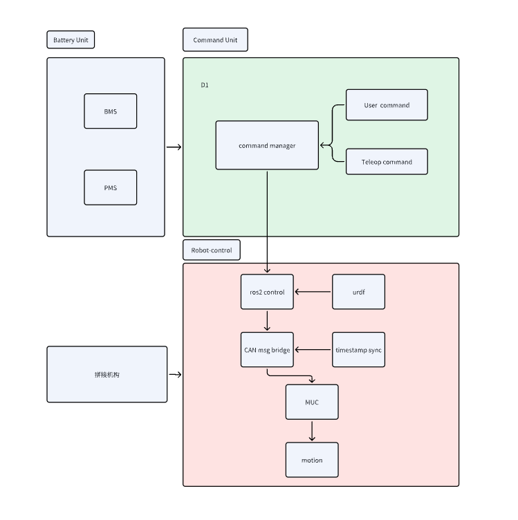

# SDK Development
```{toctree}
:maxdepth: 1
:glob:
```
------

## SDK Overview


### System Architecture Diagram




D1 provides a ROS2 SDK, and the main data interaction uses two modes: Publish/Subscribe and Request/Response.

- **Publish/Subscribe**:
  The receiver subscribes to a message, and the sender publishes messages according to the subscription list.
  Mainly used for medium/high frequency or continuous data interaction.

- **Request/Response**:
  A query–response mode, where data retrieval or operations are performed via requests.
  Used for low-frequency or mode-switch operations.


For details, see[Quick Start](Quick_Start.md)。

------


## Lower-Level Control Example

### Application Example

This example shows how to use the `tita_robot` package to control robot joints and obtain battery information.
Use only on an actual robot.

```cpp{.hljs language-cpp background-color=#f0f0f0}
#include <time.h>

#include <algorithm>
#include <chrono>
#include <iostream>
#include <map>
#include <memory>
#include <string>
#include <thread>

#include "tita_robot/tita_robot.hpp"

tita_robot robot(8, 2, "can0");

void test_read()
{
  while (1) 
  {
    std::cout << "=================================" << std::endl;
    auto q = robot.get_joint_q();
    auto v = robot.get_joint_v();
    auto t = robot.get_joint_t();
    auto status = robot.get_joint_status();
    auto quat = robot.get_imu_quaternion();
    auto accl = robot.get_imu_acceleration();
    auto gyro = robot.get_imu_angular_velocity();
    for (size_t i = 0; i < q.size(); i++) {
      std::cout << "q[" << i << "] = " << q[i] << "\tv[" << i << "] = " << v[i] << "\tt[" << i
                << "] = " << t[i] << std::endl;
    }
    for (size_t i = 0; i < status.size(); i++) {
      std::cout << "status[" << i << "] = " << status[i] << " ";
    }
    std::cout << std::endl;
    std::cout << "quat = " << quat[0] << " " << quat[1] << " " << quat[2] << " " << quat[3]
              << std::endl;
    std::cout << "accl = " << accl[0] << " " << accl[1] << " " << accl[2] << std::endl;
    std::cout << "gyro = " << gyro[0] << " " << gyro[1] << " " << gyro[2] << std::endl;
    sleep(1);
  
  }
}

void test_write()
{
  while (1) {
    std::cout << "=================================" << std::endl;
    std::vector<double> t = {0.0, 0.0, 0.0, 0.5, 0.0, 0.0, 0.0, 0.5};
    robot.set_target_joint_t(t);
    sleep(1);
  }
}

int main(int argc, char * argv[])
{
  (void)argc;
  (void)argv;
  test_read();
  // test_write();

  return 0;
}

```

Create the `CMakeLists.txt` file:
```bash
cmake_minimum_required(VERSION 3.10)
project(lower_sdk_example)

set(CMAKE_CXX_STANDARD 17)
set(CMAKE_CXX_STANDARD_REQUIRED ON)

add_compile_options(-Wall -Wextra -Wpedantic)
set(LOWER_SDK "/opt/d1_ros2/")  #tita_robot 安装路径

include_directories(
    ${LOWER_SDK}/include
)

link_directories(
    ${LOWER_SDK}/lib  
)

add_executable(lower_sdk_example lower_sdk_example.cpp)

target_link_libraries(lower_sdk_example
    tita_robot  
    pthread     
)
```

### Motion Control Interfaces
(1) Set motor torque
```bash
 /**
     * @brief Set the target joint feed-forward torques.
     * @param t the target joint feed-forward torques.
     * @return return true if the target is set successfully.
     */
  bool set_target_joint_t(const std::vector<double> & t);
```

(2) Set MIT PD control
```bash
  /**
     * @brief MIT control method. Set the target joint positions, velocities, kp, kd and feed-forward torques of the
     motors.
     * @param q the target joint positions in radians.
     * @param v the target joint velocities in radians per second.
     * @param kp the target joint proportional gains.
     * @param kd the target joint derivative gains.
     * @param t the target joint feed-forward torques.
     *
     * @return return true if the target is set successfully
     */
  bool set_target_joint_mit(
    const std::vector<double> & q, const std::vector<double> & v, const std::vector<double> & kp,
    const std::vector<double> & kd, const std::vector<double> & t);
```

------

## Data Reading Interfaces

The following interfaces are accessed by loading the dynamic library `/opt/d1_ros2/lib/tita_robot.so`, communicating via **CANFD**.
Refer to the above *CMakeLists.txt* for linking.

### Battery Status Query Interfaces
Used to obtain real-time battery parameters for power management and low-battery warnings.

```cpp{.hljs language-cpp background-color=#f0f0f0}
  /**
     * @brief Get the current battery is connected.
     * @param index: the index of battery.
     * @return bool: if battery is connected, return true.
     */
  bool get_battery_is_connected(int index) const;
  /**
     * @brief Get the current battery voltage.
     * @param index: the index of battery.
     * @return float: current battery voltage in volts.
     */
  float get_battery_voltage(int index) const;
  /**
     * @brief Get the current battery temperature.
     * @param index: the index of battery.
     * @return float: current battery temperature in degrees Celsius.
     */
  float get_battery_temperature(int index) const;
  /**
     * @brief Get the current battery current.
     * @param index: the index of battery.
     * @return float: current battery current in amperes.
     */
  float get_battery_current(int index) const;
  /**
     * @brief Get the current battery percentage.
     * @param index: the index of battery.
     * @return float: current battery percentage in percent.
     */
  float get_battery_percentage(int index) const;
  /**
     * @brief Get the current battery cell voltage.
     * @param index: the index of battery.
     * @return std::vector<float>: current battery cell voltage in volts.
     */
  std::vector<float> get_battery_cell_voltage(int index) const;
```

### Robot Core State Interfaces
These interfaces provide essential data for motion control and state estimation, covering IMU, motor, and joint modules.

```cpp{.hljs language-cpp background-color=#f0f0f0}
/**
     * @brief Get the current states update timeout.
     * @return bool: if current states not update, return true.
     */
  bool imu_data_timeout() const;
  /**
     * @brief Get the current states update timeout.
     * @return bool: if current states not update, return true.
     */
  bool motors_data_timeout() const;
  /**
     * @brief Get the current joint positions in joint space.
     * @return std::vector<double>: current joint positions in radians.
     */
  std::vector<double> get_joint_q() const;

  /**
     * @brief Get the current joint velocities in joint space.
     * @return std::vector<double>: current joint velocities in radians per second.
     */
  std::vector<double> get_joint_v() const;

  /**
     * @brief Get the current joint torques in joint space.
     * @return std::vector<double>: current joint torques in Newton meters.
     */
  std::vector<double> get_joint_t() const;

  /**
     * @brief Get the current joint status.
     * @note Joints status now is in bool value, true means the joint is online(TODO).
     * @return std::vector<uint16_t>: current joint status.
     */
  std::vector<uint16_t> get_joint_status() const;
  /**
     * @brief Get the current imu quaternion of mcu.
     * @note Quaternion sequence is x y z w.
     * @return std::array<double, 4>: current quaternion.
     */
  std::array<double, 4> get_imu_quaternion() const;  // x y z w

  /**
     * @brief Get the current imu acceleration of mcu.
     * @return std::array<double, 3>: current acceleration.
     */
  std::array<double, 3> get_imu_acceleration() const;

  /**
     * @brief Get the current imu angular velocity of mcu.
     * @return std::array<double, 3>: current angular velocity.
     */
  std::array<double, 3> get_imu_angular_velocity() const;

  /**
     * @brief Set the target joint feed-forward torques.
     * @param t the target joint feed-forward torques.
     * @return return true if the target is set successfully.
     */
  bool set_target_joint_t(const std::vector<double> & t);

  /**
     * @brief MIT control method. Set the target joint positions, velocities, kp, kd and feed-forward torques of the
     motors.
     * @param q the target joint positions in radians.
     * @param v the target joint velocities in radians per second.
     * @param kp the target joint proportional gains.
     * @param kd the target joint derivative gains.
     * @param t the target joint feed-forward torques.
     *
     * @return return true if the target is set successfully
     */
  bool set_target_joint_mit(
    const std::vector<double> & q, const std::vector<double> & v, const std::vector<double> & kp,
    const std::vector<double> & kd, const std::vector<double> & t);
    
```