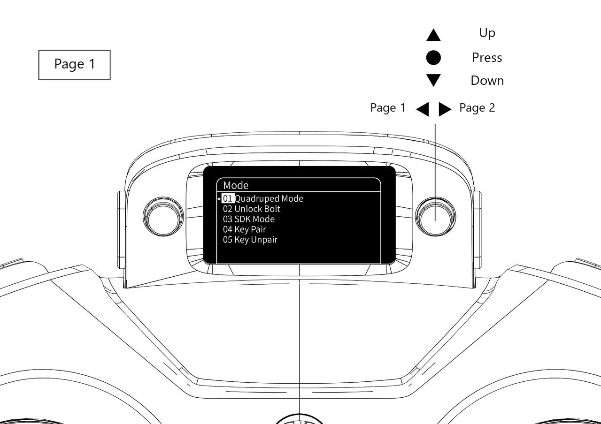
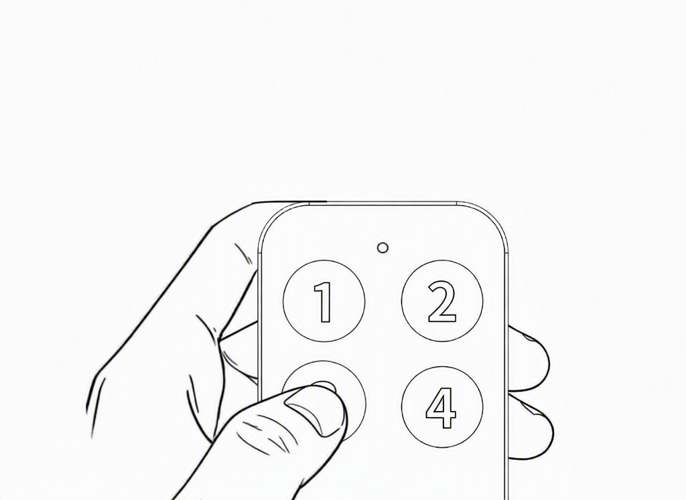

# Hardware Pairing and Connection

```{toctree}
:maxdepth: 1
:glob:
```

------

## Remote Controller Pairing Method 1

```{note}
For older system versions, install the pairing tool using `sudo apt install crsf-app`.
```

1. Install crsf-app (skip if already installed):
```bash
sudo dpkg -i crsf-app
# If not installed:
sudo apt update
sudo apt-get install crsf-app
```
2. Run the pairing command:

    ```
    crsf-app -bind
    ```

     <br>You should see output similar to the screenshot.

3. Power on the remote controller. Push the right-side button left to enter the menu, then navigate:
    Tools → ExpressLRS → Bind. This starts binding with the receiver.

    
      
     <br>

4. When pairing is successful, the controller will display: **pair success**
   
---
 <br> <br>

## Remote Control Pairing Method 2

1. Keep the robot powered on. Connect the data cable to the robot's USB-C port shown below and to the remote controller.

   

   Once connected, the remote controller displays the `Select mode` menu. Choose the third option, `USB Serial`.

   

2. Wait until the remote controller's blue LED blinks slowly or stays on. Pairing is then complete.

## Remote Emergency Stop Switch Pairing

1. Open page 1 of the robot's remote controller menu, select **04 Key Pair**, and press to confirm.

   

2. When the buzzer sounds, press **button 3** on the remote emergency stop switch. You can press it repeatedly if needed.

   
