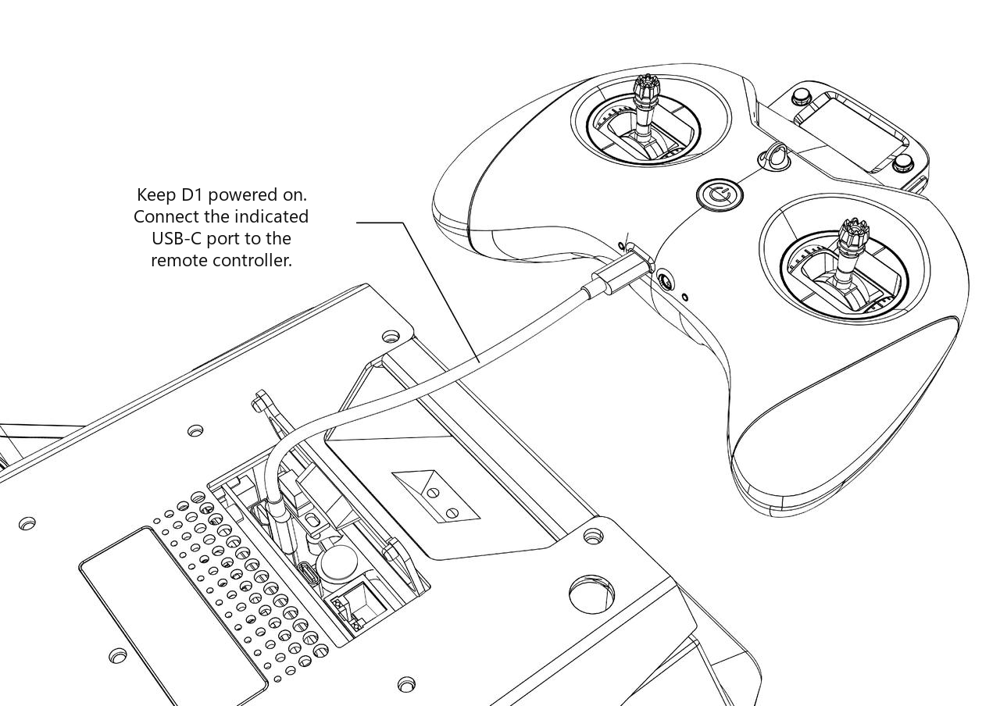
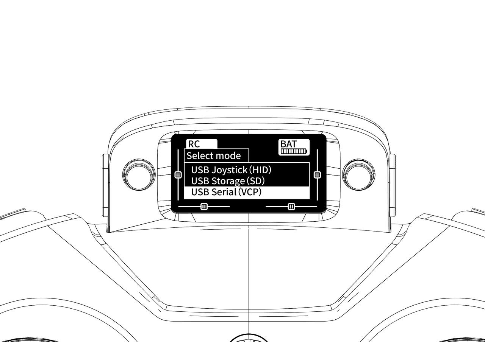
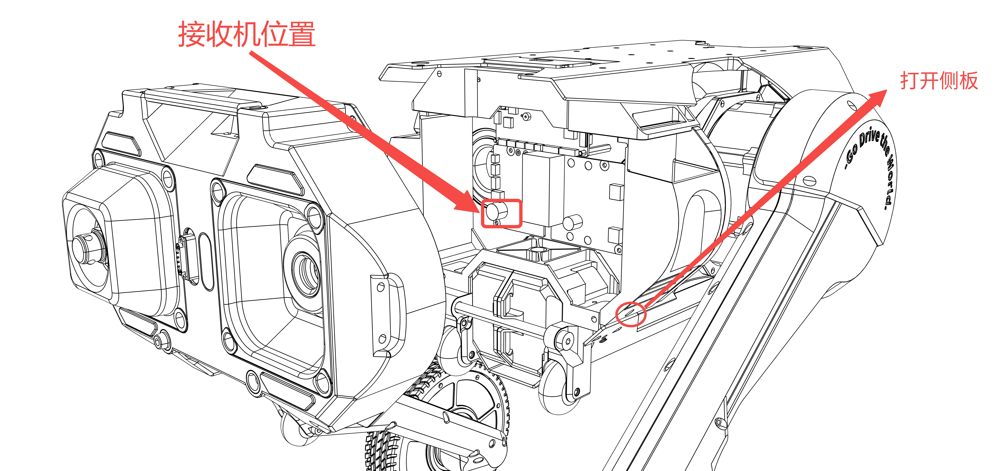
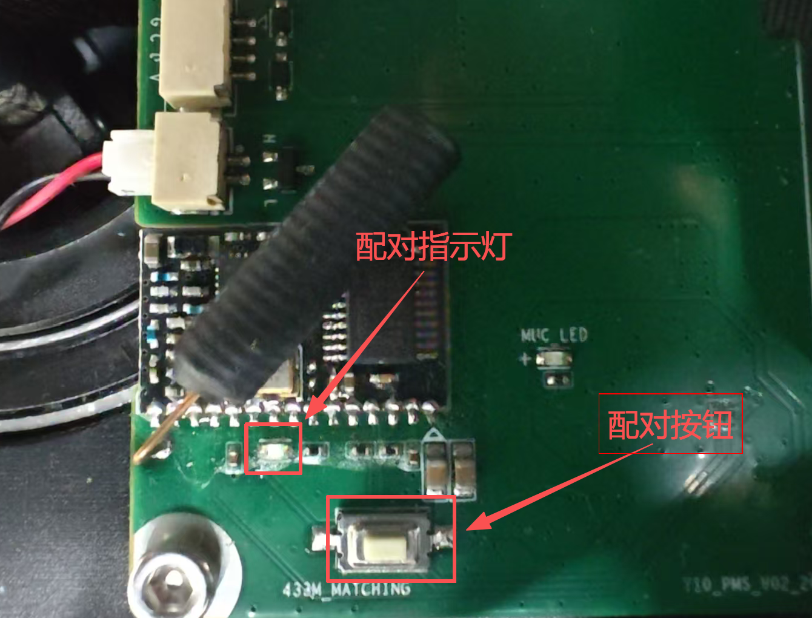
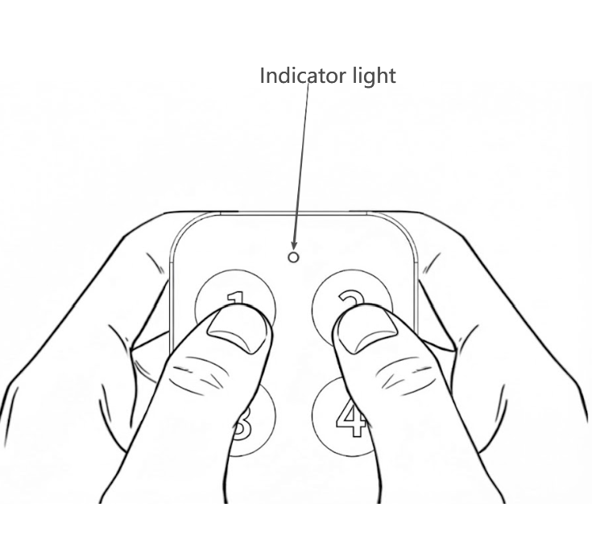
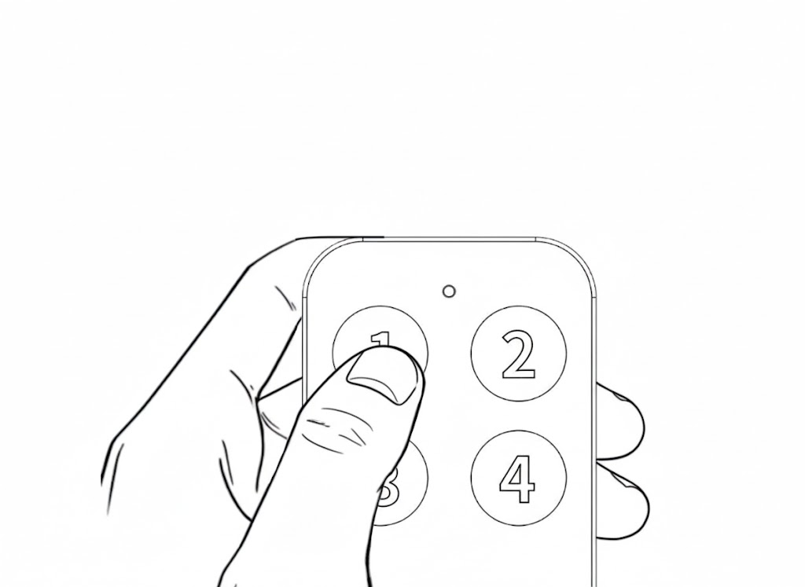

# 硬件配对与连接

```{toctree}
:maxdepth: 1
:glob:
```

------

## 遥控器配对方法一

```{note}
对于较旧的系统版本，使用 `sudo apt install crsf-app` 安装遥控器配对软件
```

1. 使用`sudo dpkg -i crsf-app`（如果已经包含或已安装，请跳过此步骤。）
```bash
#如果没有安装 `crsf-app` 可以通过以下指令
sudo apt update
sudo apt-get install crsf-app
```
2. 执行指令`crsf-app -bind`，可以观察到返回：
 
<br> 
3. 遥控器开机后 右边按键向左推进入界面后 按键依次进入Tools ->ExpressLRS-> bind模式，进行配对接收机.
 
  
 <br>
4. 配对完成返回pair success
 
---
 <br> <br>  


## 遥控器配对方法二
1. 机器人保持开机状态，将数据线连接到原理网口的type-c口以及遥控器（如下图所示）

遥控器和机器人连接后，遥控器会出现`Select mode`的界面，并选择第三个选项`USB Serial`

2. 等待遥控器的蓝灯慢闪或常亮后，即完成配对
## 远程急停开关配对

1. 将机器的侧板拆开，露出远程急停开关的接收机和按钮。

<br>
2. 长按接收机配对按钮5s，等待配对指示灯常亮。

<br>
3. 同时长按远程急停开关的按钮1和按钮2，直至遥控器上的指示灯常亮。

<br>
3. 再次按下按钮1

<br>

4. 重启后，配对完成！
